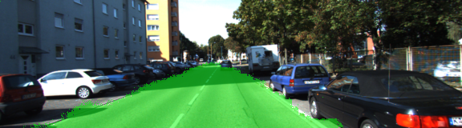
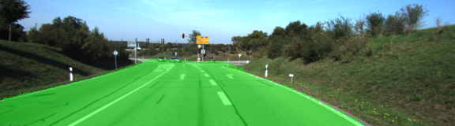
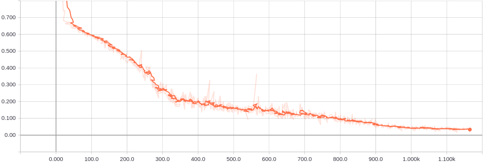
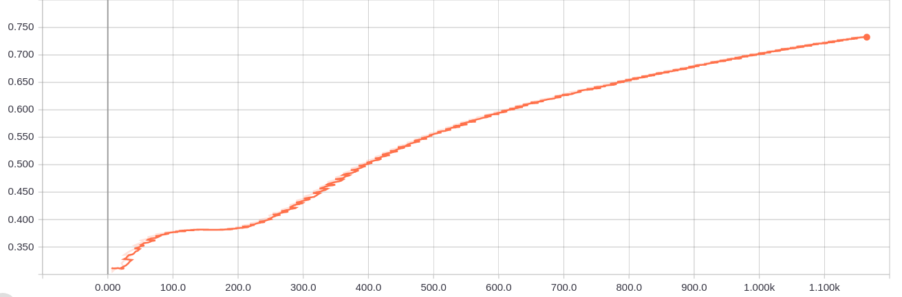
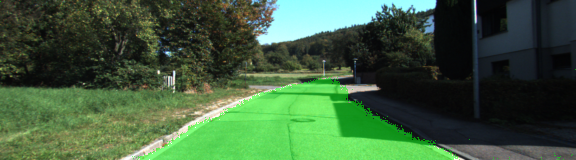
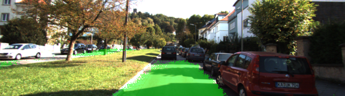

# Road Segmentation with Fully-Convolutional Network on KITTI Dataset

---





The goal of this project is the following:
* Label the pixels of a road in images using a Fully Convolutional Network (FCN). 

---

## Environment Setup

### 0. Dependencies

##### a. GPU
`main.py` will check to make sure you are using GPU - if you don't have a GPU on your system, you can use AWS or another cloud computing platform.

##### b. Frameworks and Packages
Make sure you have the following is installed:
 - [Python 3](https://www.python.org/)
 - [TensorFlow](https://www.tensorflow.org/)
 - [NumPy](http://www.numpy.org/)
 - [SciPy](https://www.scipy.org/)

##### c. Dataset
Download the [Kitti Road dataset](http://www.cvlibs.net/datasets/kitti/eval_road.php) from [here](http://www.cvlibs.net/download.php?file=data_road.zip).  Extract the dataset in the `data` folder and rename the extracted dataset folder as _kitti_.

##### d. Pre-Trained FCN VGG16
 - The link for the frozen `VGG16` model is hardcoded into `helper.py`.  The model can be found [here](https://s3-us-west-1.amazonaws.com/udacity-selfdrivingcar/vgg.zip)
 - The model is not vanilla `VGG16`, but a fully convolutional version, which already contains the 1x1 convolutions to replace the fully connected layers. Please see this [forum post](https://discussions.udacity.com/t/here-is-some-advice-and-clarifications-about-the-semantic-segmentation-project/403100/8?u=subodh.malgonde) for more information.  A summary of additional points, follow. 
 - The original FCN-8s was trained in stages. The authors later uploaded a version that was trained all at once to their GitHub repo.  The version in the GitHub repo has one important difference: The outputs of pooling layers 3 and 4 are scaled before they are fed into the 1x1 convolutions.  As a result, some students have found that the model learns much better with the scaling layers included. The model may not converge substantially faster, but may reach a higher IoU and accuracy. 
 - When adding l2-regularization, setting a regularizer in the arguments of the `tf.layers` is not enough. Regularization loss terms must be manually added to your loss function. otherwise regularization is not implemented.

### 1. How to Enjoy
Run the following command to start the FCN segmentator:
```shell
python main.py
```

---

## Network Architecture

### Overview

This project uses the FCN-8 architecture proposed in this paper <a href="reference/fully-convolutional-networks-for-semantic-segmentation.pdf">Fully Convolutional Networks for Semantic Segmentation</a>

### Pre-Trained VGG16 as Encoder

First the pre-trained VGG16 will be loaded and relevant tensor handlers will be extracted for later use.

```python
def load_vgg(sess, vgg_path):
    """
    Load Pretrained VGG Model into TensorFlow.
    :param sess: TensorFlow Session
    :param vgg_path: Path to vgg folder, containing "variables/" and "saved_model.pb"
    :return: Tuple of Tensors from VGG model (image_input, keep_prob, layer3_out, layer4_out, layer7_out)
    """
    # load the model and weights
    vgg_tag = 'vgg16'
    vgg_input_tensor_name = 'image_input:0'
    vgg_keep_prob_tensor_name = 'keep_prob:0'
    vgg_layer3_out_tensor_name = 'layer3_out:0'
    vgg_layer4_out_tensor_name = 'layer4_out:0'
    vgg_layer7_out_tensor_name = 'layer7_out:0'
    
    # load VGG16 meta graph:
    tf.saved_model.loader.load(sess, [vgg_tag], vgg_path)
    vgg_graph = tf.get_default_graph()

    # extract tensors:
    vgg_input_tensor = vgg_graph.get_tensor_by_name(vgg_input_tensor_name)
    vgg_keep_prob_tensor = vgg_graph.get_tensor_by_name(vgg_keep_prob_tensor_name)
    vgg_layer3_out_tensor = vgg_graph.get_tensor_by_name(vgg_layer3_out_tensor_name)
    vgg_layer4_out_tensor = vgg_graph.get_tensor_by_name(vgg_layer4_out_tensor_name)
    vgg_layer7_out_tensor = vgg_graph.get_tensor_by_name(vgg_layer7_out_tensor_name)

    return vgg_input_tensor, vgg_keep_prob_tensor, vgg_layer3_out_tensor, vgg_layer4_out_tensor, vgg_layer7_out_tensor
```

### Decoder

The decoder is implemented as follows. Here 1-by-1 convolution and transposed convolution are used to strike a balance between parameter complexity and model capacity.

```python
def layers(vgg_layer3_out, vgg_layer4_out, vgg_layer7_out, num_classes):
    """
    Create the layers for a fully convolutional network.  Build skip-layers using the vgg layers.
    :param vgg_layer3_out: TF Tensor for VGG Layer 3 output
    :param vgg_layer4_out: TF Tensor for VGG Layer 4 output
    :param vgg_layer7_out: TF Tensor for VGG Layer 7 output
    :param num_classes: Number of classes to classify
    :return: The Tensor for the last layer of output
    """
    # decoder layer1:
    decoder_layer1 = tf.layers.conv2d(
        inputs = vgg_layer7_out,
        filters = num_classes,
        kernel_size = 1,
        strides = (1, 1),
        padding = 'same',
        kernel_initializer = tf.contrib.layers.xavier_initializer(seed = 42)
    )
    decoder_layer1 = tf.layers.conv2d_transpose(
        inputs = decoder_layer1,
        filters = num_classes,
        kernel_size = 4,
        strides = (2, 2),
        padding = 'same',
        kernel_initializer = tf.contrib.layers.xavier_initializer(seed = 42)
    ) 
    # decoder layer2:
    decoder_layer2 = tf.layers.conv2d(
        inputs = vgg_layer4_out,
        filters = num_classes,
        kernel_size = 1,
        strides = (1, 1),
        padding = 'same',
        kernel_initializer = tf.contrib.layers.xavier_initializer(seed = 42)
    )
    decoder_layer2 = tf.add(
        decoder_layer1,
        decoder_layer2
    )
    decoder_layer2 = tf.layers.conv2d_transpose(
        inputs = decoder_layer2,
        filters = num_classes,
        kernel_size = 4,
        strides = (2, 2),
        padding = 'same',
        kernel_initializer = tf.contrib.layers.xavier_initializer(seed = 42)
    ) 
    # decoder layer3:
    decoder_layer3 = tf.layers.conv2d(
        inputs = vgg_layer3_out,
        filters = num_classes,
        kernel_size = 1,
        strides = (1, 1),
        padding = 'same',
        kernel_initializer = tf.contrib.layers.xavier_initializer(seed = 42)
    )
    decoder_layer3 = tf.add(
        decoder_layer2,
        decoder_layer3
    )
    decoder_layer3 = tf.layers.conv2d_transpose(
        inputs = decoder_layer3,
        filters = num_classes,
        kernel_size = 16,
        strides = (8, 8),
        padding = 'same',
        kernel_initializer = tf.contrib.layers.xavier_initializer(seed = 42)
    )

    return decoder_layer3
```

### Loss and Optimization

Here cross-entropy loss is used as optimization loss for Adam optimizer. Besides, mean IOU is also calculated to directly evaluate the trained segmentor's performance.

```python
def optimize(nn_last_layer, correct_label, learning_rate, num_classes):
    """
    Build the TensorFLow loss and optimizer operations.
    :param nn_last_layer: TF Tensor of the last layer in the neural network
    :param correct_label: TF Placeholder for the correct label image
    :param learning_rate: TF Placeholder for the learning rate
    :param num_classes: Number of classes to classify
    :return: Tuple of (logits, train_op, cross_entropy_loss)
    """

    # logits:
    labels = tf.reshape(correct_label, (-1, num_classes))
    logits = tf.reshape(nn_last_layer, (-1, num_classes))
    # cross-entropy loss:
    cross_entropy_loss = tf.reduce_mean(
        tf.nn.softmax_cross_entropy_with_logits(
            labels = labels,
            logits = logits 
        )
    )
    # mean IOU:
    mean_iou, mean_iou_op = tf.metrics.mean_iou(
        tf.argmax(tf.cast(correct_label, tf.float32), axis = -1),
        tf.argmax(nn_last_layer, axis = -1),
        num_classes
    )
    # optimization
    train_op = tf.train.AdamOptimizer(learning_rate).minimize(cross_entropy_loss)

    return logits, train_op, cross_entropy_loss, mean_iou_op, mean_iou
```

### Training

The model is trained using mini-batch gradient descent. During the training, cross-entropy loss and mean IOU are collected using Tensorboard logger to monitor the training process.

```python
def train_nn(sess, epochs, batch_size, get_batches_fn, train_op, cross_entropy_loss, mean_iou_op, mean_iou, input_image,
             correct_label, keep_prob, learning_rate):
    """
    Train neural network and print out the loss during training.
    :param sess: TF Session
    :param epochs: Number of epochs
    :param batch_size: Batch size
    :param get_batches_fn: Function to get batches of training data.  Call using get_batches_fn(batch_size)
    :param train_op: TF Operation to train the neural network
    :param cross_entropy_loss: TF Tensor for the amount of loss
    :param input_image: TF Placeholder for input images
    :param correct_label: TF Placeholder for label images
    :param keep_prob: TF Placeholder for dropout keep probability
    :param learning_rate: TF Placeholder for learning rate
    """
    import numpy as np

    # add entry for tensorboard:
    tf.summary.scalar('cross_entropy_loss', cross_entropy_loss)
    tf.summary.scalar('mean_iou', mean_iou)

    # tensorboard visualization
    summary_op = tf.summary.merge_all()

    # initialize logger:
    logger = tf.summary.FileWriter(
        'tensorboard/training',
        sess.graph
    )

    # initialize variables:
    sess.run(tf.global_variables_initializer())
    sess.run(tf.local_variables_initializer())
    
    # training:
    for epoch in range(epochs):
        losses = []
        batch_idx = 0
        # generate mini batch:
        for X, Y in get_batches_fn(batch_size):
            _, _, loss, summary = sess.run(
                [train_op, mean_iou_op, cross_entropy_loss, summary_op],
                feed_dict = {
                    input_image: X,
                    correct_label: Y,
                    keep_prob: 0.9,
                    learning_rate: 1e-3
                }
            )

            batch_idx += 1

            losses.append(loss)
            # update logger:
            logger.add_summary(summary, epoch * batch_size + batch_idx)
        mean_loss = np.asarray(losses).mean()
        print("[Epoch {}]: {}".format(epoch + 1, mean_loss))
```

---

## Network Training

### Training Process

The cross-entropy loss curve is as follows. It decreases steadily as epoch goes.



### Hyperparameters

A laptop with GTX1080 GPU is used for this project.

* __Batch Size--12__ The batch size is gradually increased until the out-of-memory error is throwned by GPU. After that, the max size that does not drain the GPU memo is used as final batch size. 
* __Epoch--96__ I tried 32, 64, 72 and notice the loss curve would still decrease steadily. My final choice is 96 cuz under this choice the loss still decrease steadily and I have no time to further tune this parameter.

### Performance

The mean IOU curve is shown below. The final score is slightly less than 0.75



Two sample segmentations are shown here:



